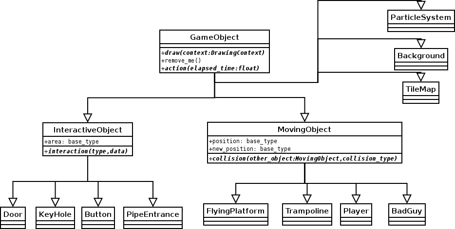
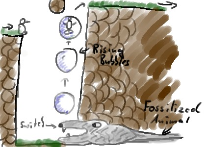
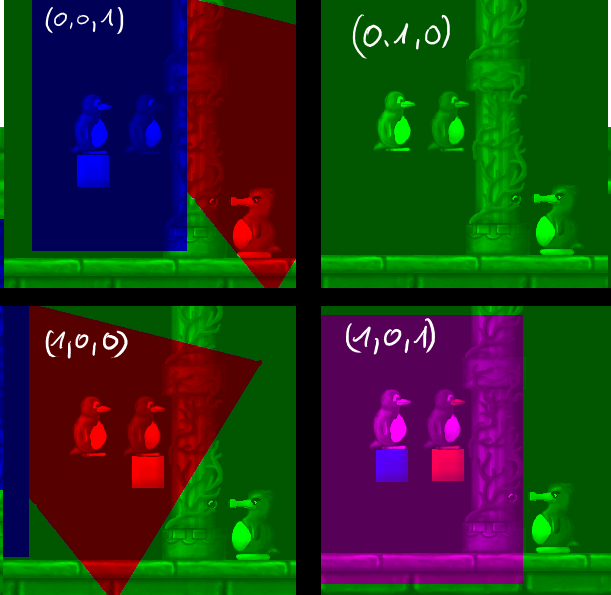
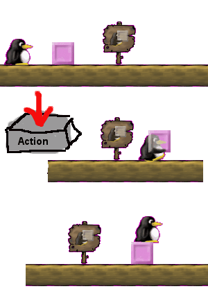

*This page is about the class in the source code. For a list of objects available in the game, see [Objects](Objects "wikilink").*

<Template:Outdated>  **GameObject** is a base class in the *SuperTux* source code. It is the most basic class for objects in the game. Nearly everything should inherit from this class, for instance [badguys](badguy "wikilink"), [unstable tiles](unstable_tile "wikilink") and [trampolines](trampoline "wikilink"). All *GameObjects* are stored in a list by the engine. This list will be traversed twice per frame. First the action function is called on each object, and then the draw function of each object is called.

The class also contains a flag that indicates if the object should be removed at the end of the frame. You can call `->remove_me()` to set this flag.

Derived classes
---------------

### InteractiveObject

These are objects you can interact with. The objects will have an area in the world. And you can send interaction events to them. Typical interaction events will be activate/push, ~EnterArea/touch, ~LeaveArea, hit with object

### MovingObject

This class provides a position and functions for collision detection. All Moving objects are held in a separate list by the engine which is also traveled once (between action and draw calls) for collision detection.

Class hierarchy
---------------

*As of [6274](Template:Revision "wikilink").*

-   GameObject
    -   AmbientSound
    -   Background
    -   BouncyCoin
    -   BrokenBrick
    -   Camera
    -   DisplayEffect
    -   Electrifier
    -   EndSequence
        -   EndSequenceFireworks
        -   EndSequenceWalkLeft
        -   EndSequenceWalkRight
    -   FallingCoin
    -   Fireworks
    -   FloatingImage
    -   FloatingText
    -   Gradient
    -   LevelTime
    -   Light
        -   PulsingLight
    -   MovingObject
        -   Block
            -   BonusBlock
            -   Brick
            -   InfoBlock
            -   InvisibleBlock
        -   Bullet
        -   Flower
        -   MovingSprite
            -   BadGuy
                -   AngryStone
                -   Bomb
                -   BouncingSnowball
                -   Dart
                -   DartTrap
                -   Dispenser
                -   Fish
                -   Flame
                -   FlyingSnowBall
                -   GhostTree
                -   Jumpy
                -   KamikazeSnowball
                -   Kugelblitz
                -   Mole
                -   MoleRock
                -   MrRocket
                -   Plant
                -   Root
                -   SkullyHop
                -   SpiderMite
                -   Stalactite
                    -   YetiStalactite
                -   Toad
                -   Totem
                -   TreeWillOWisp
                -   WalkingBadguy
                    -   CaptainSnowball
                    -   Crystallo
                    -   Igel
                    -   MrBomb
                    -   MrIceBlock
                    -   MrTree
                    -   PoisonIvy
                    -   SmartBall
                    -   Snail
                    -   SnowBall
                    -   Spiky
                    -   SSpiky
                    -   Stumpy
                    -   WalkingLeaf
                -   WillOWisp
                -   Yeti
                -   Zeekling
            -   BicyclePlatform
            -   Candle
            -   Coin
            -   Decal
            -   Explosion
            -   Firefly
            -   GrowUp
            -   IceCrusher
            -   InvisibleWall
            -   Ispy
            -   MagicBlock
            -   OneUp
            -   Platform
                -   HurtingPlatform
            -   PneumaticPlatform
            -   PowerUp
            -   PushButton
            -   Rock
            -   ScriptedObject
            -   SkullTile
            -   Star
            -   UnstableTile
            -   WeakBlock
        -   Player
        -   TriggerBase
        -   Wind
    -   Particles
    -   ParticleSystem
        -   CloudParticleSystem
        -   GhostParticleSystem
        -   SnowParticleSystem
    -   ParticleSystem\_Interactive
        -   CometParticleSystem
        -   RainParticleSystem
    -   RainSplash
    -   SmokeCloud
    -   SpecialRiser
    -   Spotlight
    -   SpriteParticle
    -   TextObject
    -   Thunderstorm
    -   TileMap
    -   worldmap::LevelTile
    -   worldmap::SpecialTile
    -   worldmap::SpriteChange
    -   worldmap::Teleporter
    -   worldmap::Tux

Background_Images
=================

With levels that can vary in size both horizontally and vertically comes
the need for background images that have the same property. This however
causes problems with images that show, for example, a sky; we don't want
it to repeat below the ground.

We have three solutions for this.

The first is to divide images into three rows. All of these are tilable
horizontally (like the milestone 1 backgrounds). Additionally, the top
and bottom rows are also tilable vertically. Thus, the middle part of
the image has a fixed vertical size while the top and bottom are
variable.

Second, we create background images out of tilemaps. These can scroll at
different rates than the main frame, but the level author can ensure
that the tilemaps are big enough.

Finally, we can anchor images to a portion of the screen so that
vertical movement doesn't affect the image.

Bonus_block
===========

Bonus blocks are blocks that Tux can hit with his head to get coins or
powerups.

The editor differentiates which powerups are given:

A common bonus block giving [Tux](Tux "wikilink") 1 coin.

A wooden crate, yielding six coins, one per hit.

The same as the normal crate, but is used when the area is more snowy.

Standard powerup, meaning an egg, a fireflower, or an iceflower
depending on whether Tux is big.

Invincibility star. Collisions which would kill Tux instead kill the
badguy, if he is killable.

This is invisible until you hit it with your head. It then appears as an
empty bonus block. These are often used to produce paths to [secret
areas](Secret_Area "wikilink").

This block releases a tiny penguin when hit. It goes up slightly at an
angle away from the side Tux hits it on, then curves and goes down, to
be lost forever unless Tux can catch it before it goes into the ground.
He currently gets 100 coins. This could be changed as he only loses
about 25 when he dies.

All bonus blocks look like this once used, but there are also some which
begin like this. They act exactly like a normal, solid block.

Bubble_Dispenser
=================

<Template:NeedCode> <Template:NeedSound> A bubble dispenser is a device
that, when activated, creates bubbles that slowly float upward. Tux can
jump into one of these bubbles to get upward movement; he is also able
to control floating speed and movement to the sides a bit. Bubbles are
destroyed on contact with solid tiles or objects, whereupon Tux is
released. The following sketch shows such a bubble dispenser as it could
appear in the forest world, in form of a fossilized dragon that starts
spitting bubbles as soon as Tux “wakes” him by jumping on his nose.

Buttons\_and\_switches
======================

**Buttons and
switches** could be used a lot.

1.  To open doors/[switchable blocks](switchable_blocks "wikilink")
2.  To change direction of conveyor belts or pipes with multiple
    directions (when water is inside and pushing Tux)
3.  To turn lights on/off

Camera\_blocker
===============

<Template:NeedCode> The camera blocker is a trigger-tile that prevents
the camera from scrolling into a certain direction (i.e. the camera will
stop scrolling if it would bring a camera blocker tile into sight).
Also, it will instantly kill Tux on contact. It will be used to create
gaps in vertical-scrolling levels and to hide certain places from the
player. Of course, like all trigger tiles, this must be used with care!

Camera
======

Level are typically a lot bigger than the actual screen, so we need to
scroll the currently visible part around. This page collects some rules
to do this in a nice way.

Analysis of some [Cameras in Super
Mario](Cameras_in_Super_Mario "wikilink")

Basic movement
--------------

Basically these are the same rules as for Yoshi's Island. Maybe we will
tweak it later or add special exceptions for new abilities.

### Horizontal Movement

-   Keep the middle point of Tux at 1/3rd of the screen width. If Tux
    moves/looks into the other direction, then slowly move the camera so
    that tux stands in the 1/3rd of the other side of the screen. This
    movement has to get faster if Tux moves into that direction. When
    Tux gets pushed into the other direction (but still looks forward)
    we don't change camera mode but just scroll when he gets pushed
    nearer than 1/3rd of the other side.
-   We might experiment about changing the camera when Tux is running to
    1/4th or so. We should test if this is desirable because then you
    see more stuff that's before you. On the other side a too dynamic
    camera movement can confuse and making it harder to control Tux
    exactly.

### Vertical Movement

-   Basically keep Tux in the middle of the screen.
-   When Tux does a normal jump we don't scroll vertically until he
    stands on ground again or falls deeper than the hight where he
    started the jump. An exception to this rule are trampolines.

Special modes
-------------

### Autoscroll

The camera might scroll automatically so that Tux can't wait but has to
hurry to not get squished by the moving camera somewhere. Ideally you
can specify a path of vectors (together with speed) that the camera
follows.

### Right only scroll

This was used in the 0.1.1 release. It might be still used to not forget
our history ;-)

Configurable Camera
-------------------

I worked a bit on the code and put all parameters that influence the
camera in a configuration file. You can now open data/camera.cfg and
play with the parameters yourself. This way you can test/try out fixed
camera, Yoshi Island and Kirby Camera and their parameters easily. You
can make the game reparse the Camera by typing
“sector.Camera.reload\_config()” on the console. Put
[camera.cfg](http://supertux.lethargik.org/viewvc/viewvc.cgi/branches/supertux/0_3_x/data/camera.cfg?view=markup)
in \~/.supertux2/ .

Door
====

[Template:Milestone 2](Template:Milestone_2 "wikilink")
[Tux](Tux "wikilink") can enter **doors** to be teleported to a
different part of the level, even in a different sector.

Infoblock
=========

 An **Infoblock** is a [game
object](game_object "wikilink") which is used to provide non-obvious
information for the player. It is displayed as a green block with a
white exclamation mark. When jumping against the block from below, a
message is displayed.

Format
------

The message is formatted line-wise. The first character of each line
determines how the line is formatted. The first character is not
printed. The parsing is done in three functions defined in
[src/supertux/info\_box\_line.cpp](Template:SvnFile "wikilink"). The
colors are defined in
[src/supertux/colorscheme.cpp](Template:SvnFile "wikilink").

  Character                  Type            Font size   Color
  -------------------------- --------------- ----------- ------------------------
  `\t` *(tab)*               Normal          Normal      Normal color (white)
  `␣` *(space)*              Small           Small       Small color (white)
  `-` *(dash)*               Heading         Big         Heading color (yellow)
  `*` *(asterisk)*           Reference       Normal      Reference color (blue)
  `#` *(hash)*               Normal (left)   Normal      Normal color (white)
  `!` *(exclamation mark)*   Image           *n/a*       *n/a*

Ladder
======

 An [area](Objects "wikilink")
[Tux](Tux "wikilink") can climb up in. Needs (background) graphics for
visualization.

Magic\_Block
============

Magic Blocks are
tile-like game objects that are sensitive to
[Lighting](Lighting "wikilink") conditions. They are rendered in a
primary color and will only be solid as long as light of the same color
shines on the block.

Illustration of Magic Block behaviour:\

Moving\_platform
================

 A **moving
platform** is a [MovingObject](MovingObject "wikilink") that can be used
by level designers to let [Tux](Tux "wikilink") reach high places. It
can be [scripted](ScriptingPlatform "wikilink") to start moving as a
response to some action and follows a predefined
[path](ScriptingPath "wikilink").

See also
--------

-   [Game object](Game_object "wikilink")
-   [Objects](Objects "wikilink")
-   [ScriptingPlatform](ScriptingPlatform "wikilink")
-   [ScriptingPath](ScriptingPath "wikilink")

Objects
=======

:   ''This page lists the available objects in the game. For a
    description of the *implementation* see [Game
    object](Game_object "wikilink").''

**object** is anything that can contain [sector](sector "wikilink") and
it has its position. **Tiles** aren't **Objects**!

Nicknames of objects and unexisting objects
-------------------------------------------

The following objects are available in the 0.3.x release or have been
committed to the [SVN](SVN "wikilink") repository.

-   Various [badguys](badguy "wikilink")
-   [Ambient sound](Ambient_sound "wikilink")
-   [Background Images](Background_Images "wikilink")
-   [Bicycle platform](Bicycle_platform "wikilink")
-   [Brick](Brick "wikilink") / [Broken Brick](Broken_Brick "wikilink")
-   [Bullet](Bullet "wikilink")
-   [Buttons and switches](Buttons_and_switches "wikilink")
-   [Camera](Camera "wikilink")
-   [Candle](Candle "wikilink")
-   [Coin](Coin "wikilink")
-   [Decal](Decal "wikilink")
-   [Display effect](Display_effect "wikilink")
-   [Door](Door "wikilink")
-   [Electrifier](Electrifier "wikilink")
-   [End sequence](End_sequence "wikilink")
-   [Explosion](Explosion "wikilink")
-   [Falling coin](Falling_coin "wikilink")
-   [Fireworks](Fireworks "wikilink")
-   [Floating image](Floating_image "wikilink") / [Floating
    text](Floating_text "wikilink")
-   [Flower](Flower "wikilink")
-   [Gradient](Gradient "wikilink")
-   [Growup](Growup "wikilink")
-   [Hurting platform](Hurting_platform "wikilink")
-   [Invisible block](Invisible_block "wikilink") / [Invisible
    wall](Invisible_wall "wikilink")
-   [Lantern](Lantern "wikilink")
-   [Level time](Level_time "wikilink")
-   [Light](Light "wikilink")
-   [Ladder](Ladder "wikilink")
-   [Moving platform](Moving_platform "wikilink")
-   [Oneup](Oneup "wikilink")
-   [Particle system](Particle_system "wikilink")
    -   [Cloud particles](Cloud_particles "wikilink")
    -   [Comet particles](Comet_particles "wikilink")
    -   [Ghost particles](Ghost_particles "wikilink")
    -   [Rain particles](Rain_particles "wikilink")
    -   [Snow particles](Snow_particles "wikilink")
    -   [Sprite particles](Sprite_particles "wikilink")
-   [Reset point](Reset_point "wikilink") (“Firefly” for some reason)
-   [Rock](Rock "wikilink")
-   [Scripted object](Scripted_object "wikilink")
-   [Script trigger](Script_trigger "wikilink")
-   [Secret Area](Secret_Area "wikilink")
-   [Skull tile](Skull_tile "wikilink")
-   [Smoke cloud](Smoke_cloud "wikilink")
-   [Spawn point](Spawn_point "wikilink")
-   [Special riser](Special_riser "wikilink")
-   [Spotlight](Spotlight "wikilink")
-   [Star](Star "wikilink")
-   [Teleport](Teleport "wikilink")
-   [Text object](Text_object "wikilink")
-   [Thunderstorm](Thunderstorm "wikilink")
-   [Tilemap](Tilemap "wikilink")
-   [Trampoline](Trampoline "wikilink")
-   [Unstable tile](Unstable_tile "wikilink")
-   [Wind](Wind "wikilink")
-   Special Block Types
    -   [Bonus block](Bonus_block "wikilink")
    -   [Infoblock](Infoblock "wikilink")
    -   [Invisible block](Invisible_block "wikilink")
    -   [Magic Block](Magic_Block "wikilink")
    -   [Weak block](Weak_block "wikilink")

Available in ObjectFactory
--------------------------

The following objects can actually be generated with *ObjectFactory*,
i.e. from within a level:

-   ambient\_sound
-   angrystone
-   background
-   bicycle-platform
-   bonusblock
-   bouncingsnowball
-   candle
-   captainsnowball
-   coin
-   climbale
-   crystallo
-   decal
-   door
-   dispenser
-   explosion
-   fish
-   firefly
-   flame
-   flyingsnowball
-   ghosttree
-   gradient
-   haywire
-   hurting\_platform
-   icecrusher
-   igel
-   infoblock
-   invisible\_wall
-   ispy
-   jumpy
-   kamikazesnowball
-   kugelblitz
-   lantern
-   leveltime
-   magicblock
-   mole
-   mrbomb
-   mriceblosk
-   mrtree
-   plant
-   platform
-   pneumatic-platform
-   poisonivi
-   powerup
-   pushbutton
-   rock
-   scriptedobject
-   scripttrigger
-   secretarea
-   sequencetrigger
-   skullyhop
-   skydive
-   smartball
-   snail
-   snowball
-   snowman
-   spidermite
-   spiky
-   spotlight
-   stalactite
-   switch
-   thunderstorm
-   tilemap
-   toad
-   totem
-   trampoline
-   unstable\_tile
-   valkingleaf
-   weak\_block
-   willowisp
-   wind
-   yeti
-   zeekling

Proposed objects
----------------

The following objects are *ideas* that have not yet been implemented.

-   [Bubble Dispenser](Bubble_Dispenser "wikilink")
-   [Camera blocker](Camera_blocker "wikilink")
-   [Pipes](Pipes "wikilink")
-   [Ropes](Rope "wikilink")

Pipes
=====

Note: General consensus was to avoid pipes in SuperTux. It's really a
Mario thing and doesn't fit a penguin. Instead, different objects can be
used to transfer Tux between [sectors](sector "wikilink"), such as
[doors](door "wikilink").

Uses for pipes:

-   Pipes that take Tux to sublevels
-   Pipes that don't do anything (already in some levels.)
-   Pipes Tux can walk thru, but you can't see him.
-   Pipes that have water flowing thru them. These could have switches
    and take Tux different directions.
-   Pipes that release water geysers or bubbles that take Tux to a
    different place.

Rock
====

A **rock** is a
small [object](Objects "wikilink") that [Tux](Tux "wikilink") can pick
up and move around. Tux can walk on rocks, so they are useful to reach
high places. Both Tux and enemies are hurt if a rock falls on their
head.

For a sample, see the level
[world2/builder.stl](http://supertux.lethargik.org/svn/supertux/trunk/supertux/data/levels/world2/builder.stl)
(in 0.3.0 and up).

Script\_trigger
===============

**Script triggers** are areas that trigger a script when Tux enters
them. Script triggers are commonly used to activate [moving
platforms](Moving_platform "wikilink") or [air
currents](Wind "wikilink").

Secret\_Area
============

The Secret Area
Trigger is used to mark secret areas, at the moment it fades a tilemap,
writes a message to the screen, and adds to the number of secrets the
player has found in a level, as well as marking the total number of
secrets.

It is specified something like the following: <code>

`(secretarea`\
`  (width `<width>`)`\
`  (height `<height>`)`\
`  (x `<top left corner's x coordinate>`)`\
`  (y `<top left corner's x coordinate>`)`\
`  (fade-tilemap `“<secret area tilemap cover>”`)`\
`)`

</code>

Upon entering the secret area, the specified tilemap will be faded, “You
found a secret area!” will be displayed, and the user will have one more
found secret added to his statistics. Nothing is currently done when
leaving a secret area.

Spawn\_point
============

**Spawn points** are the places where [Tux](Tux "wikilink") appears when
entering a level or a sector. Every sector has a *main* spawn point, the
one where Tux begins the level, but there may be as many spawn points as
the level designer wishes, usable to spawn Tux when he enters a
[door](door "wikilink") or touches a [script
trigger](script_trigger "wikilink").

You can use the global *Level* object to spawn Tux at a specific spawn
point. The syntax is as follows:

`Level.spawn (`“`SecretArea`”`, `“`main`”`);`

Where “SecretArea” is the name of the [sector](sector "wikilink") and
“main” is the name of the spawn point.

See also
--------

-   [ScriptingLevel](ScriptingLevel "wikilink")

Teleport
========

:   *This page is about the worldmap object. For teleportation in levels
    see [Door](Door "wikilink") and [Level
    (Scripting)](ScriptingLevel "wikilink").*

A **teleport** is an [object](objects "wikilink") on
[worldmaps](worldmap "wikilink") that teleports the player to another
part of the map. Teleporters are used primarily to hide secret levels or
to link between islands. *Bonus world 1* uses them extensively;
navigation is not possible without the use of teleporters. There are
currently two teleporters in [Icy Island](Icy_Island "wikilink")
*(World 1)*;one is an automatic one to go to [Forest](Forest "wikilink")
*(World 2)*, and the other is used to access the bonus level. In the
*Forest* world there currently is only one automatic teleporter to go
back to *Icy Island*.

Thunderstorm
============

When the
Thunderstorm goes off, you will hear distant thunder. Shortly afterwards
a lightning strikes, making the screen flash. All water in the level is
electrified when the lightning hits and reverts to normal afterwards.

The Thunderstorm can be configured to go off at regular intervals or
alternatively be scripted. See
[ScriptingThunderstorm](ScriptingThunderstorm "wikilink") for a quick
reference.

Tilemap
=======

**Tilemaps** consist of all of the ground, spikes, lava, clouds, etc.
that do not move and do not interact *actively* with the player. Each
tilemap consists of one or more [tiles](tiles "wikilink"), which each
contain several attributes specified in the
*[tileset](tileset "wikilink")*.

Tilemaps can be either *solid* or *non-solid*. The player can only
interact with *solid* tilemaps (i.e. they are used for collision
detection) but not with *non-solid* tilemaps. Non-solid tilemaps are
usually used as foreground and background layers.

Multiple tilemaps of each kind may be specified. You can think of a
*tilemap* as a *layer* of “blocks”. Each layer has an associated
*z-position* where smaller values mean further back, larger values mean
further in front.

:{| border=“1” ! z-position ! Use |- | -100 | Default background layer
|- | 0 | Default interactive layer |- | 50 | `LAYER_OBJECTS` (default
[object](Game_objects "wikilink") layer) |- | 51 |
[Tux](Tux "wikilink"), bonus blocks |- | 100 | Default foreground layer
|}

Tilemaps are also [scriptable](Scripting_reference "wikilink") if given
a (unique) name, see [ScriptingTilemap](ScriptingTilemap "wikilink").

Tilemaps may also be given a [path](ScriptingPath "wikilink"), which
they will follow once scripted to do so.

Note that [infoblocks](infoblock "wikilink"), [unstable
tiles](unstable_tile "wikilink"), [bonus
blocks](bonus_block "wikilink"), invisible blocks that can be activated,
coins, and wooden bricks are not actually part of the tilemap; after the
level is parsed, the tiles with the ID's or attributes representing
those objects are replaced with the objects themselves and the tiles
changed to empty.

Trampoline
==========

The trampoline is a small [object](Objects "wikilink") that [Tux](Tux
"wikilink") can pick up and move around. When [Tux](Tux "wikilink")
jumps on the trampoline the springs compress and then Tux is launched
into the air. Trampolines will allow Tux to bounce up to areas he
could not normally jump to.

    (trampoline
      (x 320)
      (y 1056)
      (portable #f)
    )

**x** and **y** are the coordinates as usual. **portable** is a optional
flag which defaults to true. Set it to false to prevent the player from
carrying that trampoline around.

Unstable\_tile
==============

**Unstable tiles** are a special kind of [tile](tile "wikilink") on
which [Tux](Tux "wikilink") can stand only for a limited time. After
that, the block starts to dissolve and / or to fall down.

The sprites for unstable tiles may have four *actions*:

normal
:   Displayed until [Tux](Tux "wikilink") steps on the tile.

shake
:   The tile shakes but is still solid.

dissolve
:   The tile is dissolving. After the animation for this action is done,
    the tile will be set non-solid.

fall-down
:   Gravity is enabled for this tile and it will begin to fall down.

Each of the actions *shake*, *dissolve* and *fall-down* is optional. If
a sprite doesn't have the *dissolve* action, the till will still be
solid when the *fall-down* action is executed (Donut Tile style). If the
tile doesn't have a *fall-down* action, it will be removed after the
*dissolve* animation is done (Giana Sisters style).

Weak\_block
===========

 This is a special kind of block
that can be destroyed by shooting it with a
[fireflower](fireflower "wikilink") or when something explodes nearby,
[Mr. Bomb](Mr._Bomb "wikilink") for example.

Wind
====

Generally speaking, Wind is a region in a level that influences Tux'
speed while he's not standing on solid ground. Wind can be scripted to
create e.g. air gushes coming out of pipes or water streams that can
be switched on and off. See [ScriptingWind](ScriptingWind "wikilink")
for a detailed description about how to manipulate a Wind object with
Squirrel scripts.
