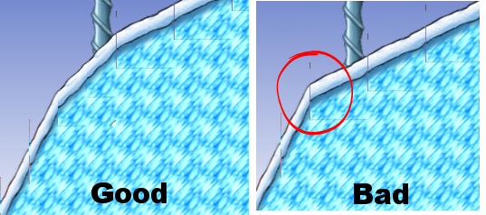
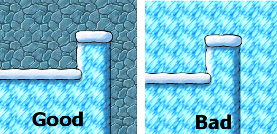
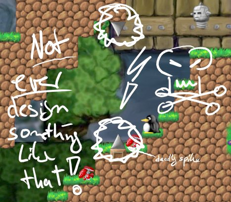
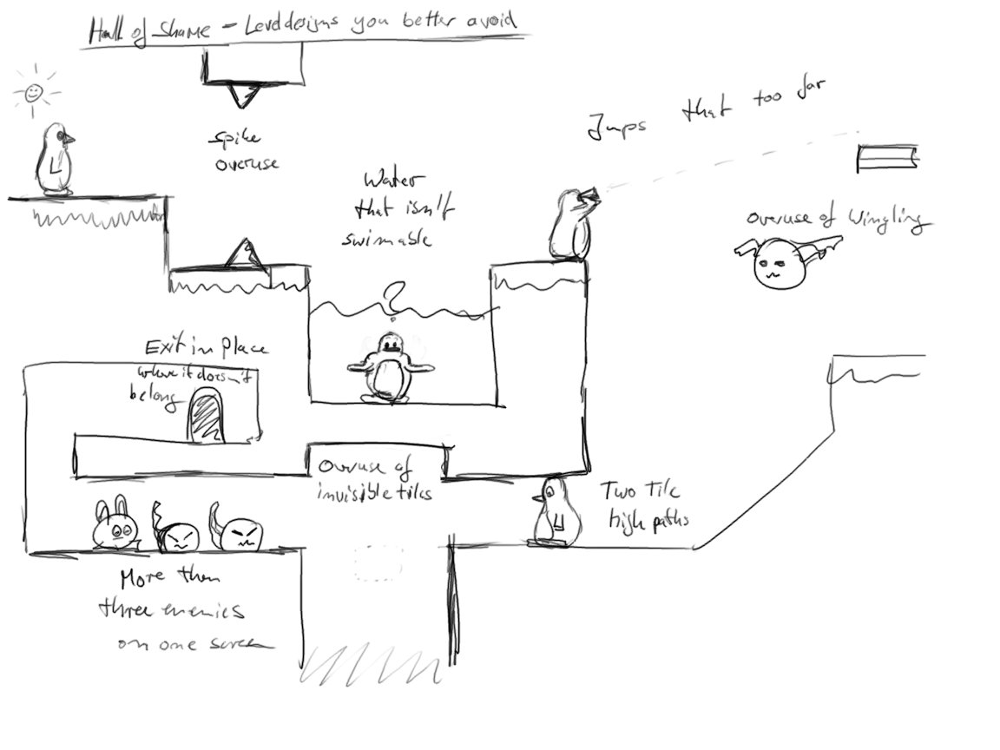

These guidelines should be kept for any level that appears in the main
SuperTux level sequence. Any deviation should be rare and with great
consideration (for example for a secret area). Designers making custom
levels intended for an [Add-on](Add-on "wikilink") or Bonus Island are
free of regulations - that's what those sections are for. However,
keep in mind that if your levels violate too many of these suggestions
people will likely find them not very fun.

Setting
-------

In [Milestone 2](Milestone_2 "wikilink"), will have [Icy
Island](Icy_Island "wikilink") as game discovering area, the island
already present in [Milestone 1](Milestone_1 "wikilink"). It has a
snow and ice setting, so please use the appropriate [tiles](tile
"wikilink") only. Most of them are in the “Snow” and “Blocks” groups
in the level editor. There are numerous other tiles currently
available in the editor, but they are either either not finalized
(e.g. ice mountain) or not appropriate for *Icy Island*. In that first
world, only basic elements should be found. It will present a revised
[Forest](Forest "wikilink"), where more elaborate elements may be
found. The Boss have to be designed. And eventually a third world
(proposed to be [Tropical\_Island](Tropical_Island "wikilink")) with
the Fun Pif quest. Please Note that Neither art or code is ready yet
for this part, then you shall not design any level with their elements
already available.

Difficulty
----------

The goal of *SuperTux* is to be fun, not to be hard. So the goal is to
make *fun* levels, not to make them *challenging*. Remember that a
player will get frustrated and annoyed if he dies more than small
number of times in a level and also keep in mind that a player will
see the level for the first time when he plays it.

**Tip:** If you are in doubt if a level is getting too hard, change
the style of play to something that is unfamiliar to you, invert
left/right controls, play with the left hand, play only as small Tux
or anything like that. If you can still beat the level without
problems and without dying, it likely is easy enough. If not, then it
is likely too hard.

Enemies
-------

Do not randomly mix enemies of all different kinds. Level should
follow a certain theme and thus focus on enemies that fit that theme.
For example, fire enemies should only appear in castle levels. In
addition, don't just randomly place each and every type of snow enemy
into a level- pick a few enemies that best fit into your level.

Be mindful of how enemies react to the environment when deciding where
to put them. For example, snowball will always fall off ledges while
smartball will always turn around at a ledge, thus snowball is a poor
choice in a sky level where smarball is much more appropriate. Enemies
should not fall off the screen before players have a chance to engage
them, and it should be possible to fill out the *badguys killed* stat.
Finally avoid placing enemies where they will reach a spawn point.
This is most important around the level start and reset points, as
there should be ample time for a player to see and assess the level
before being forced to act. Levels that switch back-and-forth between
sectors are also prone to having an enemy wander into a spawn point
resulting in Tux being hurt immediately after spawning- this is bad
and makes players sad.

Slopes
------

When creating slopes, make sure that they are smooth and don't make
sudden jumps in inclination. Note when using slopes that some
combinations are ill-fitting; ignore these artifacts as they are
graphics problems, not level problems. You may want to avoid the use
of steep slopes for the time being, at least until the slope collision
physics are improved some more. Along those same lines, the placement
of slopes directly next to a vertical wall currently produces some
bizarre behavior and should be avoided until the mechanics are
improved.

Tiles
-----

Don't use tiles in the background that were built for the foreground.
Use only special background tiles in the background. In general, don't
ever mix tilesets. Clearly distinguish between the layers - players
should be able to see immediately where they can safely walk and what
is foreground and background. Secret areas can violate this.

Size
----

Levels *must* be at least 25 tiles high, and using at least 32 tiles
is recommended. Levels should be between 250 and 350 tiles long. (A
couple of levels in [Icy Island](Icy_Island "wikilink") are over
500 tiles long – newer levels should not be this long and it's
possible we'll split up those long levels in the future.) Any vertical
scrolling sector should be no narrower than 40 tiles wide to ensure it
displays well in every resolution setting currently supported by
SuperTux.

File Naming Conventions
-----------------------

When saving the level file, stick with the convention used for the
worldmap. For example, *Icy Island* levels are named like this: *02 -
example level.stl* where the number (02 in the example) showing what
order you play the levels, and the level name are separated by a
hyphen. The level extension is *.stl*, if you forget the extension,
the level will not be recognized. If you need an example of naming
convention, look at the data/levels/world1 directory. If level order
does not matter, or is unknown, the number and hyphen can be omitted.

Note: having spaces in the level names makes command-line manipulation
of files for development atrocious, there should probably be a
discussion about changing the convention to use underscores in the
level names instead.

However, it's not critical that custom levels necessarily follow the
same naming convention. It is nevertheless best to stick with a
non-cryptic naming scheme where it is obvious which file is for which
level.

Sectors
-------

When making a level, use floors and ceilings where appropriate. Basic
rule of thumb is that your environment should visually make sense. For
example:

-   Overground areas should have a floor and no ceiling.
-   Underground/cave and interior areas should have both a floor and a ceiling.
-   Sky area should have neither a floor nor ceiling.

Transitions between sectors should also make sense. Having Tux walk
off a screen of overground ice and suddenly appearing in the middle of
a castle is confusing. Also one-way sector transitions should only be
used where it is logical, such as dropping down a hole. Doors should
be two-way. Sectors designed to be next to each other should be able
to be visually connected.

Other
-----

SuperTux is meant to be a fair and fun game, so don't create unfair
configurations, like a spike on the roof as well as one on the ground,
that require way too much precision or luck and just aren't fun to
play.

Other things to avoid:

1.  Creating paths that are only two tiles high, make things high
    enough that SuperTux can jump.
2.  Don't create jumps that require pixel perfect precision unless it
    is for a special secret area.
3.  Don't use invisible tiles for normal gameplay.
4.  Keep the number of enemies that are on the screen at once small,
    it shouldn't be more then three for most cases.
5.  Do not overuse switches and doors: SuperTux isn't an adventure
    game, it's a jump'n run, so make the level straightforward and
    easy to understand.
6.  Avoid creating large monotonous spaces; players get tired of
    running around a huge level.
7.  Try to limit the use of reset points; if you can get away with
    none whatsoever, do so.
8.  Don't allow dead ends or impossible levels; either the player
    dies, or there's still a way to solve it. (Allowing the player to
    suicide from a trap works as well) Test your level thoroughly to
    find possible paths you missed before.
9.  Avoid too hard or too easy levels. Too easy levels get boring very
    quickly while too hard ones can be frustrating. Levels you built
    often appear a lot easier for yourself, so be sure to let other
    people test them.
10. Secret areas should be well-hidden and not be visible on first
    sight, but can still have a visual cue that they are there. Use
    your imagination to think of new ways to create secrets - some of
    the above rules can be broken for that purpose, but be careful!
11. Avoid impossible-to-reach coins, powerups, areas, and badguys.
    Collecting everything or reaching everywhere in a level is often
    important to players. However, difficulty can be just short of
    impossible - requiring frame-by-frame accuracy is fine. (So long
    as you provide a demo to prove that it is in fact possible) This
    only applies to bonus items - players should be able to complete
    the level minus some items with only moderate difficulty.
12. Avoid using any water. Swimming and water physics have not been
    finalized, so any current water behavior is unreliable.
13. Avoid using very steep slopes or placing slopes next to vertical
    walls, the collision physics is still a bit off.
14. Don't overuse “new” things (enemies, objects, tiles): Use them
    when and where they make sense. Don't use them just because they
    are new.
15. Change gravity only when it has sense. Don't change it, when you
    want only Tux jumping higher/lower.

External Links
--------------

-   Secret Maryo Chronicles has some at <http://secretmaryo.org/wiki/index.php?title=Level_Design_Guidelines>

Old Stuff
---------

These guidelines should be kept for any level that appears on the
official world maps. Designers contributing levels to the Contrib and
Bonus sections are free of regulations - that's what those sections
are for. However, to maintain a certain level of playability, official
levels should be designed with these rules in mind:

1. Don't mix tilesets! There shouldn't be any ice or castle tiles in a
   forest level, unless there is an obvious reason (like transition
   into another area).

2. Clearly distinguish between the layers - players should be able to
   see immediately where they can safely walk and what is foreground
   and background. Avoid placing bonus items (coins, boxes) in the
   background.

3. Be careful not to create dead ends. Test your level thoroughly to
   find possible paths you might have missed before.

4. Use everything the engine offers - but don't place it all in a
   single level!

5. Avoid large amounts of objects and badguys on the screen at once as
   it greatly decreases playability. Also, your level might not be
   playable on slower machines anymore.

6. Find the right difficulty! Too easy levels get boring very quickly
   while too hard ones can be frustrating. Levels you built often
   appear a lot easier for yourself, so be sure to let other people
   test them.

7. Don't make your level too short or too long - good size largely
   depends on the level's overall design, so there's no general "good"
   value. In longer levels, make sure there are enough reset points,
   so players won't have to repeat large portions of the level.

8. Secret areas should be well-hidden and not be visible on first
   sight. Use your imagination to think of new ways to create
   secrets - some of the above rules can be broken for that purpose,
   but be careful!

9. Icecrushers (Krush and Krosh) should be able to reach their
   original position and shouldn't get stuck anywhere in the middle
   when rising.
