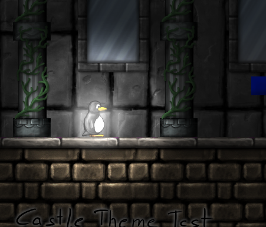
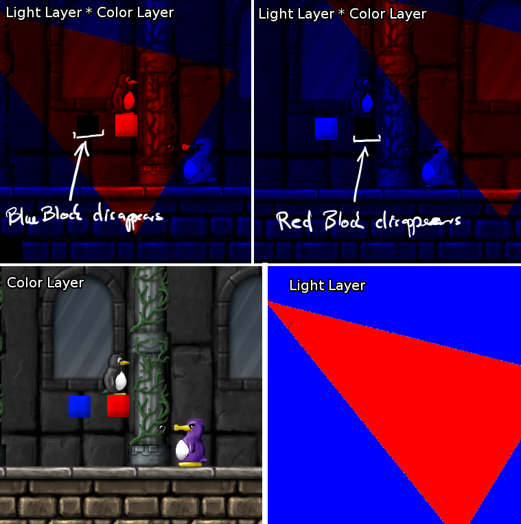

Lighting is a post-processing effect that can be used to add
athmosphere to a SuperTux level, it works by darkening parts of the
screen.

To accomplish this effect the game uses two layers for drawing, the
`color` layer is used for regular drawing, while the `light` layer is
used to draw objects to the lightmap. The lightmap layer is drawn to a
separate texture and drawn over the `color` layer with multiplicative
blending, the final pixel color is thus:

    framebuffer = (color * light)

The color layer itself does not exist as a separate texture, but only
implicitly. The lightmap is drawn over framebuffer when drawing
objects from the color layer passes `z-pos == LIGHTMAP_LAYER`. All
color objects above that `z-pos` will not be affected by lighting
effects, which is useful for GUI elements, but can also be used to
create lens flares effects and brightly glowing objects.

To create said lens flares add objects to the color layer with a z-pos
bigger than LIGHTMAP_LAYER and set their blend mode to additive.

Magic Lighting
--------------

While lighting is primarily just for visuals, game objects can also
react to lighting changes, this is done by doing a lookup of pixel
color on the lightmap.

The idea behind magic lighting is that an object which only uses
colors from a single color channel, say only the red one, turn
completly black when illuminated by a light source that only contains
colors of the other channels (blue and green).

This also works with multiple color channels at once, meaning a
magenta (1,0,1) colored light will make both red and blue objects
visible, while hiding green ones, while a green light will make red
and blue objects disapear.

Since its very hard to actually see where a light source is located on
a dark background, the highlight layer should be a copy of the light
layer, thus illuminating the level better and making the light sectors
visible.
