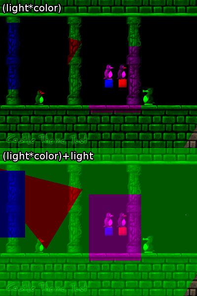

<Template:Outdated>

Simple Lighting
---------------

Lighting is a post-processing effect that can be used to add
athmosphere to a SuperTux level, it works by either darkening or
brightning parts of the screen. To implement that effect two
additional layers need to be rendered, first the **light layer** and
second the **highlight layer**. The order is as follows, first the
color layer (the normal sprites, background and stuff) is rendered as
usual, then the light layer is rendered to an offscreen buffer with
multiply enabled and last the highlight layer is rendered with
addition enabled, so we get:

    Framebuffer = (Color * Light) + Highlight

The light layer itself needs to be an offscreen buffer, while the
highlight layer can be just a collection of sprites, since additive
rendering is commutative.

Lighting in this simple form as no direct impact on gameplay, except
that it might make parts of the game area harder to see.

Color Lighting
--------------

Color lighting is a special form of magic light that does impact
gameplay, the implementation for the rendering is the same as with
Simple Lighting, in addition however color lighting requires special
code to remove and add tiles to the tilemap depending on if they are
in a lightcone or not.

The idea behind color lighting is that an object which only uses
colors from a single color channel, say only the red one, turn
completly black when illuminated by a light source that only contains
colors of the other channels (blue and green).

This also works with multiple lighting, meaning a magenta (1,0,1)
colored light will make both red and blue objects visible, while
hiding green ones, while a green light will make red and blue objects
disapear.

Additional code in the game engine is required to turn the colored
lighting, which so far is only a visual effect, into one that actually
removes the invisible blocks from the tilemap or flags them, so that
Tux can't stand on a block that isn't visible.

Since its very hard to actually see where a light source is located on
a dark background, the highlight layer should be a copy of the light
layer, thus illuminating the level better and making the light sectors
visible.
